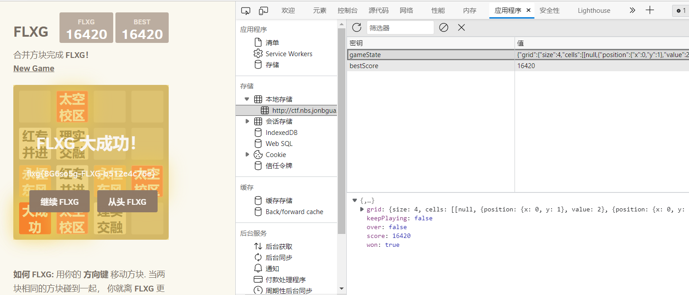
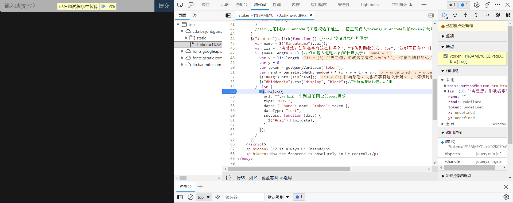

# 信安实践I级第一次官方题解

## TA 武汉

## 进制十六——参上

这道是 2021Hackergame 的原题，题目描述非常<del>中二</del>富有激情，但是其实仔细看一下下面的图片我们可以发现，16进制和字符的 ascII 码是一一对应的，所以虽然字符被抹去了，我们依然可以根据对应的16进制找到原来的符号是什么，思路大概就是这样。至于具体做法，我看有很多同学手算，也有一些同学用电脑算，这里我提供一种方法。首先可以在电脑端 QQ 发送图片，然后用 QQ 自带的 OCR 功能进行16进制的获取(可能需要改个别识别错的)，之后可以使用python或者网上搜索16进制转字符,如[16进制转换文本字符串，在线16进制转换](https://www.sojson.com/hexadecimal.html)，有很多网站可以帮你做这件事情。

## 2048

这道题属于是经典永流传了（x 原题是 2020Hackergame 的原题，此后就一直被当作例题出现在信安实践里。课上我们已经讲过正常做题的流程了，这边就给大家演示一些奇技淫巧(bs)

```javascript
//在控制台输入如下代码
GameManager.prototype.addRandomTile = function () {
if (this.grid.cellsAvailable()) {
    var value = 8192;
    var tile = new Tile(this.grid.randomAvailableCell(), value);

    this.grid.insertTile(tile);
}
};
//然后随便玩两下就发现直接大成功（（
```

上面的做法纯纯炫技-.-<del>毕竟看js这么熟练的人不可能找不到访问的url吧</del>，下面介绍另一种不是很炫技，也很巧妙的方法



我们发现这个分数是保存在`本地存储`里的，这就意味着我们可以修改它。在控制台输入

```javascript
let gameState = JSON.parse(localStorage.gameState)
gameState.score = '1145141919'
gameState.won = true
localStorage.gameState = JSON.stringify(gameState)
location.reload()
```

上面的 js 代码是暴力修改并刷新 本地存储 的过程

如果你觉得

> 啊 好麻烦，我不会 javascript

那也完全没问题，本地存储支持直接修改，我们直接从

```
{"grid":{"size":4,"cells":[[null,null,{"position":{"x":0,"y":2},"value":2},null],[null,null,null,null],[null,null,null,null],[null,{"position":{"x":3,"y":1},"value":2},null,{"position":{"x":3,"y":3},"value":4}]]},"score":4,"over":false,"won":false,"keepPlaying":false}
```

修改一下变成

```
{"grid":{"size":4,"cells":[[null,null,null,null],[null,null,{"position":{"x":1,"y":2},"value":4096},{"position":{"x":1,"y":3},"value":4096}],[null,null,null,{"position":{"x":2,"y":3},"value":4096}],[null,null,null,{"position":{"x":3,"y":3},"value":4096}]]},"score":0,"over":false,"won":false,"keepPlaying":false}
```

之后再操作几次你就可以 大成功 了

## 虚假的安全

这道题是自己出了一道考察异或性质的题目，异或( xor )的性质是

若A xor B = C 则 C xor B = A

或者说两次异或操作之后返回自身。

很多同学不知道python怎么写，自己手算异或确实很辛苦；也有同学用C/C++写，也很棒！

答应给大家出的python简单入门在[这里](https://meeting.tencent.com/v2/cloud-record/share?id=38b5aa4a-f993-450c-8502-745caa5b7e21&from=3&is-single=true) 密码是 FBXS ，建议如果想听的可以二倍速

有同学理解错了这道题的意思，这个题里面已经提到 `已知打印结果、key长度和msg的格式，其余均未知`就是说`key='mask5'`只是说明key是个长度为5的密钥，其具体内容是不知道的；也有同学不明白key = key*5的含义，这里实际上是说把5个key字符串拼接在一起。

我们知道 key xor "flag{" = output 的前五位，根据异或的性质，我们就应该能算出来 key 是什么。

这里给出两个 python 脚本

```python
secret = [14, 13, 17, 55, 2, 35, 15, 64, 39, 38, 31, 82, 65, 60, 38, 9, 35, 31, 38, 13, 55, 57, 64, 2, 4]
secret = secret[:5]#取前五个
msg = "flag{"
key = []
for i in range(len(msg)):#i 从 0 到 msg 长度减 1 循环
    key.append(ord(msg[i])^secret[i])#ord把字符转换为数字，之后异或
    key.append(chr(key[i]))#chr把数字转成字符
key = "".join(key)#把字符列表合成连续的字符串
print(key)#输出为:hapPy
```

上面的脚本可以算出来 key 的值，知道 key 之后，要得到明文，只需要再用我们已知的 secret 异或key 填充之后的结果就可以了

```python
secret = [14, 13, 17, 55, 2, 35, 15, 64, 39, 38, 31, 82, 65, 60, 38, 9, 35, 31, 38, 13, 55, 57, 64, 2, 4]
key = "hapPy"
key = key*5
msg = []
for i in range(len(secret)):
    msg.append(chr(ord(key[i])^secret[i]))
msg = "".join(msg)
print(msg)
```

## 你的名字

这道题也是有很多同学表示不理解的题目，其实逻辑很简单：你输入助教的名字，前端会拦下来你(因为按钮不能用、名字长度大于1)，只有绕过这个限制，成功把数据传到了后端，后端验证你给的名字是正确的，才算是能拿到 flag 。所以很多同学问怎么输了一个字符会报500错误，是因为后端校验不通过导致的。所以这里就可以开始写了

最简单的办法就是检查代码，发现我们要向后端发送一个请求才能拿到 flag 。但是正常情况下这个代码不可能执行，那我们就把这段代码 copy 到控制台，再把 name 和 token 进行赋值即可。

```javascript
$.ajax({
            url: "",//发送一个到当前网址的post请求
            type: "POST",
            data: { "name": "张广为", "token": "你自己的token" },
            dataType: "text",
            success: function (data) {
              $("#msg").html(data);//这里也可以改成console.log(data) 可以直接打印出来内容
            }
          });
```

其他方法：

首先把提交的 disabled 给去掉，之后进入 F12 的源代码页面打断点，因为此时 name 栏是空的，所以程序会跳入 else 逻辑执行。这时手动在控制台里修改 name 和 token 即可。



## 小结

整体来看这周同学们做的还是蛮不错的o(*￣▽￣*)ブ应该都或多或少的了解了一些基本的前端调试小技巧，下周是简单的 HTTP 请求，主要会说一些网络间通信的大概方式，大家继续加油(ง •_•)ง
