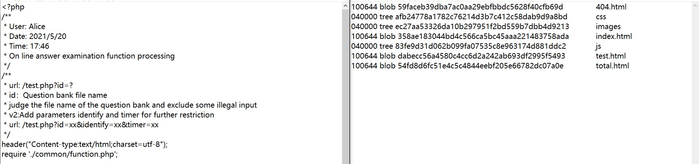

# 一级第三次 WriteUp
## author: 武 汉

哈喽又是我，今天给大家放一下第三次课的题解

## 猫咪问答

- 陈炜铿学长用来纠正读音的咖啡馆叫什么名字？

  - 很多同学看到这都懵了，但是不要着急，合适的搜索引擎是第一步(下面搜索类的题目可能会有个性化推送，所以如果我的题解不适合你的电脑浏览器，你可以再尝试一下别的组合方式)，**必应，国内的神！** <del>如果你能访问到谷歌的话当然更好。</del> 总之就是不要用某度搜了，很难有结果的（
  - 这里我们都用 bing.com 去搜索。搜 `陈炜铿` 这边会出现[陈炜铿的个人主页网站](https://www.chenweikeng.com)。如果有同学看的仔细的话，这里其实藏了两个答案。第一个就是 `Pronunciation of the name` ，这里陈炜铿学长饱受被叫错名字之苦，于是跟人专门解释其名字读音。可以知道第一个题目答案是 Brewed Awakening ，第二个答案就是他本人的 GPA 了，这个在他的主页 CV 里是有的，大家可以去看看
  - 如果搜 陈炜铿 信息密度很低，底下都是 陈炜 这种结果，你可以试试我们学的 Google Hack 语法，强制搜索` "陈炜铿"`。好处是这样搜出来的一定和其本人相关，坏处是很多英文界面没有中文名就搜不到了
  - 有同学说我没好好看陈炜铿的网站，那我还有什么办法呢？可以试试搜索`陈炜铿 + pronunce` 或者 `陈炜铿 + pronounce + coffee` 或者 `陈炜铿 + pronounce + cafe` 最后一定是可以搜到的

- 我们学校是在什么时候正式接入 eduroam 服务的？

  - 这个题相对来说就比上一个好做很多，直接去搜索 `ustc eduroam 接入时间`，可能发现并没有太多信息。我们这个时候就要想，这理论上来说应该是一件大事，学校一定会有报导的。 那学校的措辞更可能是什么样的呢 于是尝试 `中国科学技术大学 接入 "eduroam" site:ustc.edu.cn` 这个时候其实已经有不少相关页面了，大家可以点进去看看。比如[中国科学技术大学：共享Eduroam联盟无线网络服务](https://staff.ustc.edu.cn/~james/eduroam/eduroam-ustc.html)这个里面 `james` 老师就有说接入的时间。还有别的，比如[科普动态 (ustc.edu.cn)](http://kepu.ustc.edu.cn/_t215/9799/listm5.htm)这个里面也有具体时间。或者也可以大概看看时间在15年左右，大胆猜测15年，直接搜 `中国科学技术大学 接入 "eduroam" 2015年 site:ustc.edu.cn` 即可

- LUG协会03年小聚合影中的bladesatan除了bladesatan@gmail.com，还使用过哪个sohu邮箱？

  - 第三题属于很爆炸的难度。这个题目要求错两道之内就可以，其实也是在考验大家判断一个东西是否容易搜索的能力。这里放出来我的搜索过程，给大家当成彩蛋，看一看这位 `LUG`创始人之一在科大的传奇经历。(**所有信息均为网络公开信息收集，没有任何非法途径**)

  - 首先搜索 `bladesatan ustc` 我们可以搜到一次 2003 年的 LUD(Linux User Dinner)（最早的小聚）照片(里面还有很多好几个留校的老师，确实很厉害)、还可以搜到 2005 年他在嵌入式讲座上的一次演讲。那个演讲的介绍说他是当时 bbs Infosec(信息安全系)版的版主。除了这个之外，我们还能找到一个2001年他在科大上课时翻译的一篇文章，署名是 马良 。这里对名字的真实性暂且不论，后面会再提到。

  - 现在的线索指向了 bbs。我们直接以访客身份登录 BBS 。然后搜索这个用户，发现已经不存在了。但是我们可以去 infosec 版里去找找看。进入 Infosec 版，然后在版内搜索 bladesatan   发现有不少帖子，我们慢慢找找看，发现在一篇名为 `操作系统上机作业提交方法`的帖子里提到了他的 sohu 邮箱，至此，题目结束。

  - 但其实，我们能得到的远不止这些。我们知道，判断信息真假的方法应该是交叉验证。就如上面的搜狐邮箱，其实原本我是不确定的。又搜了一下发现了一个 Google Code Archive 里也有这组数据，两组完全不相干的地方同时出现了关联，说明确实是其 email 地址。另外，由于 BBS 所有人都可以公开访问，我做了一个小爬虫，爬取了这个用户在 bbs 上的所有帖子。我们看到，在AI版里的`小组和复杂小组联合讨论通知`中，有人问神秘嘉宾是谁，底下出现了其本人解释，由此证实(大概率)名字是真名而非笔名。当然再往下挖下去就显得冒犯了，我本人也很佩服他们在本科时期就做了许多厉害的工作，也无意打扰前辈清净，只是说明一种信息收集的方法

  - 下面附上一个简单的 demo ，仅供学习。

  - ```python
    import requests,re
    a = requests.get("http://bbs.ustc.edu.cn/cgi/bbsall")
    name = re.findall('<a href="bbsdoc\?board=(.*?)">',a.text,re.I)
    name = list(set(name))
    all = []
    for i in name:
        a = requests.get("http://bbs.ustc.edu.cn/cgi/bbsbfind?type=1&board="+i+"&title=&title2=&title3=&userid=bladesatan&dt=9999&boardordigest=0&labelabc=0")
        m = re.findall('<a href=bbscon\?(.*?)>',a.text)
        if m != []:
            all.extend(m)
    for url in all:
        print(url)
        a = requests.get("http://bbs.ustc.edu.cn/cgi/bbscon?"+url)
        with open("result.txt","a+",encoding="gb2312",errors="ignore") as f:
            f.write(a.text)
            f.write("\n")
    ```

- 在IETF定义的无限猴子协议套件中,'This is too derivative.'对应的CRITIC拒绝代码是？

  - 这是 IETF 官方玩梗，直接搜`"This is too derivative."`即可

- 科大东区石榴园的一块刻着四句诗的石头，从左向右第二句是？

  - 这个应该也是比较难的，你当然可以去东区看一看，这是第一步。或者在网上用百度搜索`中科大 石榴园`，找到家长论坛里的 初游科大之印象 然后继续搜图片发现没有什么结果。我们猜测这个字体是小篆，把我们能看懂的几个字连起来加上 奉献即存在 我们就能找到百度知道里的翻译了。

- 科大东区原222宿舍楼被人们称为什么之一？

  - 这个如果找到技巧还是比较容易的。搜索 `中科大 老区 "222" + "宿舍"`即可


## 美味的Linux

首先ssh进入linux系统里，试一下`ls`,`cat`,`pwd`，`cd`,等常见命令，就能出来四个，最后一个是常见的网络命令`ping`，连起来的flag是 食材打人啦 >.<

P.S. 这个题目其实利用了 /etc/bash.bashrc 和 /etc/profile 的特性，把命令劫持实现的，简单让大家试试linux啦~

## Free on Sat.

&nbsp;
>这道题目考察**代码审计**和对**git**,**php**的应用，个人觉得比较综合。下面我按顺序大致写一下解题流程。

### 打开网页查找源代码
因为目的是代码审计，所以第一步不能太隐蔽了，不然可能第一眼看到这个题还以为是sql注入之类的(不过看上去也确实像)。F12可以看到index.php渲染出的代码里有很长的一段注释
内容如下:

```html
<!--
			Alice<Alice9102@gmail.com,Fri May 21 2021 16:44:47 GMT+0800> mailto <Bob9913@gmail.com>
			Theme:Update request interface to V2 version
			Contents:Bob, the Technology Department of the company requests to update the interface 
			of request /test.php in this file before 8:00a.m. tomorrow. The update parameters and 
			specific details have been sent to you through the attachment. Please check and update
			the GIT branch to the latest version.
			Bob<Bob9913@gmail.com,Fri May 21 2021 17:23:14 GMT+0800> re Alice<Alice9102@gmail.com,Fri
			May 21 2021 16:44:47 GMT+0800> mailto <Bob9913@gmail.com>
			Contents:Received.
			Bob<Bob9913@gmail.com,Sat May 22 2021 03:12:17 GMT+0800> re Alice<Alice9102@gmail.com,Fri 
			May 21 2021 16:44:47 GMT+0800> mailto <Bob9913@gmail.com>
			Contents:[Urgent]I have modified the source code according to the interface specification and 
			submitted the code on GIT. Unfortunately, I accidentally deleted the source code of the
			working environment, and git has saved the modification. I'm not very familiar with git
			command, and I don't know how to undo it,so I directly copied a copy of the latest code
			to the working directory, and the GIT repository was saved in the working directory 
			without deleting it(I kept the scene and packed it in git.zip).Please update the GIT 
			status.Thank you.
		-->
```
是更新接口的一段邮件对话，注意邮件里提到的信息(使用git托管,删除了全部文件,~~加班严重~~,~~周六凌晨三点还在工作~~),最关键的是这个人把.git文件打包放在主目录里了.所以直接访问
```text
http://ip:port/git.zip
```
把git.zip下载下来解压缩。

上面我觉得大家问题都不大，后面就是第一个难点了
&nbsp;

### 难点一：由.git还原文件结构和文件内容

————UPDATE:下面这种办法太蠢了，建议跳过然后到下一个分隔符处————

这里我参考了
```text
https://blog.csdn.net/qwqw3qee/article/details/94169852
```
的一篇文章，由于站点比较小，恢复文件结构和内容可行并且不是很麻烦。
说一下实现方法:
在git文件夹下git bash here，输入命令
```bash
find .git/objects -type f
```
如图所示


这些object都是git保存的可以恢复的文件,我们把输出保存在文件里写一个python代码构造下一步命令。
```bash
.git/objects/04/744a465f08a6757798dfa8bd8171bddb4c6363
.git/objects/20/35388fa8787d36e426154f013fac975d723581
(..省略n行..)
.git/objects/ed/72c3dfe2ce582959e5f119a2d798d79492c0a0
.git/objects/f0/ede52ef22ab66bfd2a1c0b3d8941b24456b342
```
python代码
```python
import os.path
dir_path = os.path.dirname(os.path.abspath(__file__))+'\\'
with open(dir_path+"0.txt","r")as f:
    a = f.readlines()
a = ["git cat-file -p "+i[13:15]+i[16:-1]+" > " for i in a]

for j in range(len(a)):
    a[j] += str(j+1)+".txt\n"
print(''.join(a))
```
在git bash里执行python运行的结果，得到30个txt文件

打开文件查看内容，发现这些文件可以分为两类：代码类和文件目录类

据此恢复文件目录和名称:

```
.
├── ce.php
├── common
│   └── function.php
├── data
│   ├── 1.php
│   ├── 2.php
│   └── 3.php
├── index.php
├── test.php
├── total.php
└── view
    ├── 404.html
    ├── css
    │   └── style.css
    ├── images
    │   ├── 404
    │   │   ├── b1.jpg
    │   │   └── back.jpg
    │   └── bg.png
    ├── index.html
    ├── js
    │   ├── 1.js
    │   ├── jquery.min.js
    │   └── jquery.timeout.js
    ├── test.html
    └── total.html
```
**————UPDATE:下面介绍点简单方法————**

上网搜索，git 回滚 / git 回到上一次提交

马上就可以搜到 `git reset --hard HEAD^` 是回滚到上一次提交

`git reset --hard HEAD^^ `是回滚两次

第一步结束，得到 flag1 


当然其实理清楚关键逻辑就够用了，有了源代码就要审计哪里有漏洞或者如何获取flag，看源码可以发现在function.php中有如下代码:

```php
......
    if($identify!=$time && md5($identify)==md5($time)){
        getyouwant();
    }
......
function getyouwant(){
    $handle = fopen("./common/blabla","r");//这里后来修改啦,直接访问是得不到的
    $contents = fread($handle, 1024);
    $contents = str_replace(PHP_EOL, '', $contents);
    fclose($handle);
    echo "<script>\nconsole.log('".$contents."');\n</script>";
}
```
观察参数$identify 和 $time,可以在test.php里面找到
```php
$identify=$_GET['identify'];
$time = $_GET['timer'];
//题库数据
$data=getDataById($id,$identify,$time);
```
所以构造get参数绕过代码限制即可，这也是本题第二个难点
&nbsp;

### 难点二：构造Payload参数获取flag

上网搜索 php md5 == 绕过

构造方法是利用php函数特性，让两边的 md5 都是 0e 开头的。比如下面是一个可用的 payload :
```
http://ip:port/test.php?id=1&identify=s878926199a&timer=s155964671a
```
上面就是利用 0e 在 php 中被认为是科学计数法的漏洞绕过判断，获得了 flag2


## picPic

一共是六张图片，每个人只会显示三张


北纬31°那张提示是2021年11月14号拍的，并且在车上，是周日。查询北纬31°，发现如果拍摄地在安徽的话只能在池州、铜陵或者芜湖。并且当时并非假期，助教出游可能性不大，那大概率就是集体活动了，搜索发现在当天正好有教务处组织的马拉松活动，我们直接搜索 `2021 ustc 科技英才班 秋季马拉松` 即可知道前往地点


有很多花那张图片后面楼上有英文，搜索发现是上海镛舍酒店，在地图上搜索即可知道附近地铁站


晚上在桥上拍的那张看灯笼上的字`江南贡院码头`，即可知道答案


秋天拍的街景那张，有两个路牌，虽然都不太看得清，但是可以相互印证，最后锁定位置在郑州高新区


教室里那张，助教目前大三，数学分析是大一课程，因此是2019年学的。老师可以在评课社区上比对得到。去教务处公开信息查询搜索19年课表即可


江边那张，对岸高楼上有 SIPG 搜索即可知道答案

