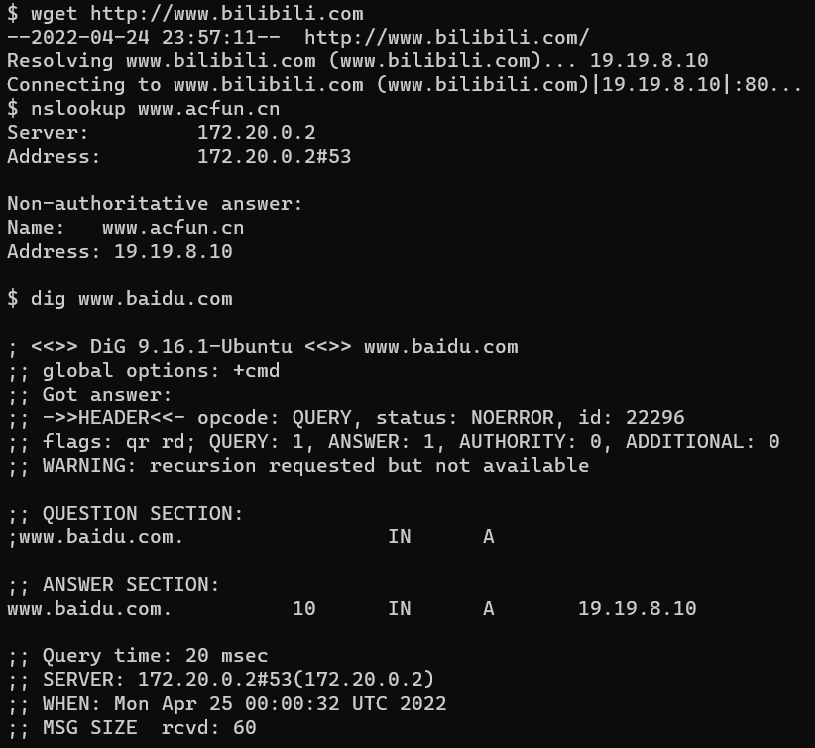
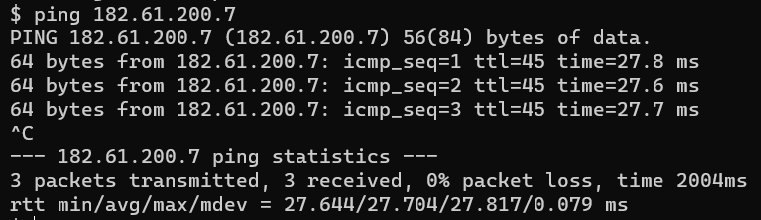
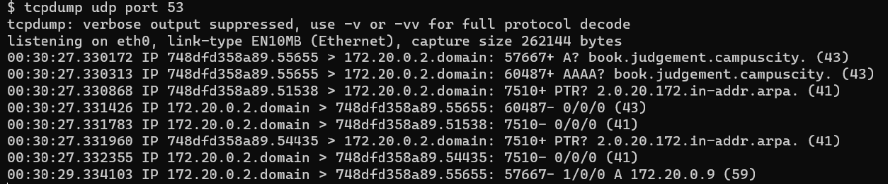
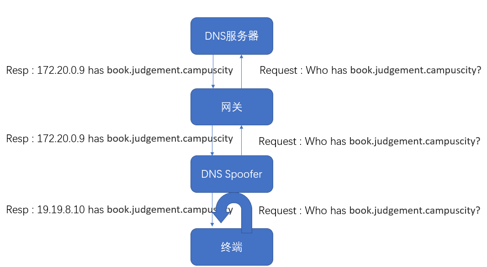

# 信安实践I级附加题官方题解

## TA 武汉

## 某科学的初春饰利

首先进入题目环境中，我们发现在环境中访问任何网址都会被跳转到 19.19.8.10 ()，不论是 wget 还是 ping 或者 nslookup 、 dig 等命令均是如此。

这说明大概率是 DNS 出了问题。为了进一步确认，我们继续测试:

IP 直接访问发现没有问题，所以确实是 DNS 解析的问题。具体是哪里出了问题，还需要进一步的排查。

 DNS 解析出现问题一般情况下要考虑两种情况: DNS 污染(投毒)和 DNS 劫持，这两种都可以达到 DNS 解析出错的目的但又有一些细微的差别。 前者是通过污染 DNS 缓存来达到暂时混淆 DNS 记录的作用，最著名的例子莫过于Kaminsky 攻击 [一次出人意料而名留青史的DNS投毒攻击 - 知乎 (zhihu.com)](https://zhuanlan.zhihu.com/p/92899876) ；而后者大多是某些不干好事的运营商(ISP)进行的(当然现在已经很少了)，他们通过修改域名解析的地址向你访问的网站中插入广告或者禁止访问某些域名等。这个题目而言，我们发现它无差别的在所有时刻阻拦了所有页面，说明是 DNS 劫持。那如何得到原有的包呢？我们发现这个 DNS 服务器设立在内网里，因此如果有人要劫持一定是在内网中进行劫持。因此在网关处接收是可以得到请求和原始回复包的。于是我们在 ping 目的域名的同时在本机网关处进行 tcpdump 抓包

发现我们抓到了请求包和应答包，至于为什么这个真实的应答 IP 没有被使用，这是因为发生了抢占，还有另一个内网里的伪造 DNS 回复包比权威应答快，因此发生了劫持现象。大概流程图如下:

当然这个图省略了很多细节，感兴趣的可以了解一下怎么伪装才能让终端相信你是真的应答。

这个题其实还有很多非预期解，我觉得最多的就是在内网里一个一个地址进行尝试，当然也不是不可以，首先你也要了解IP C类地址的有关信息才能知道这个子网的范围，下次分个大点的子网（bs

还有一些利用 ARP 包做出来的，确实很厉害，点赞
