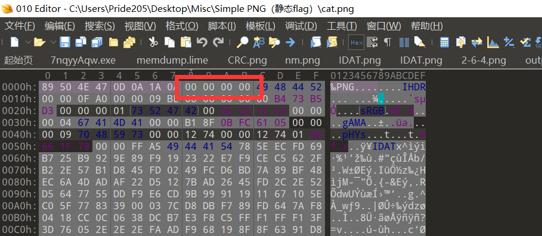

所有 Python 脚本请使用 Python 3 运行。

### Simple PNG

#### Part 1

甚至都不需要看发的讲义，随便找个正常 png 文件打开，对比就能发现文件头有问题，如下图：



红框内内容改成 `00 00 00 0D` 即可。

#### Part 2

使用界面右下角的地址跳转，跳转到图中 JPG 对应的偏移量 `0x55EC8B`：


从这个偏移地址开始一路复制到文件尾，粘贴到空文件中，保存为新的文件即可。


### IDAT

做这题的时候一定要将整个 IDAT 数据块和 IDAT 数据块中的 Chunk Data 域区分开来，现场有很多人都栽在了这上面。

参考讲义的描述，整个 IDAT 数据块是由四个域：Length、Chunk Type Code、Chunk Data、CRC。

将 **IDAT 的 Chunk Data 区块（而不是整个数据块）**复制出来，粘贴并保存到新文件：


然后使用如下 Python 脚本解密即可：

```Python
import zlib

with open("data", "rb") as f:
    print(zlib.decompress(f.read()))
```


### CRC

用脚本爆破图片宽度：

```Python
import os
import binascii
import struct

misc = open("question.png","rb").read()

for i in range(1024):
    data = misc[12:16] + struct.pack('>i',i)+ misc[20:29]
    crc32 = binascii.crc32(data) & 0xffffffff
    if crc32 == 0xBD65E39C:
        print(i)
```

然后进 010 Editor 改即可。


### LSB 隐写

#### 真实的签到题

StegSolve 使用 Data Extract 功能，选择顺序为 RGB，通道 0 即可。


#### 拼图

用 StegSolve 打开图片，点击箭头，发现 RGB 0 通道观察到异常：


利用 Save as 功能存储三个通道的图片：


再用 Image Combiner 合成为一张图片即可得到清晰可见的 flag。


当然你要是眼力 + 运气好的话，直接嗯看也是可以的。


### Base64 stego

可以写小脚本进行辅助计算，因为时间足够长，工作量也不大，当然也可以手算，规则是这样的：

- 一个等于号：取最后一个字母，查 Base64 表翻译为二进制，取最后两位数字
- 两个等于号：取最后一个字母，查 Base64 表翻译为二进制，取最后四位数字

最后把二进制全部拼起来，得到一个 24 位的二进制数，网上找个进制转换器转换成十进制数提交即可。


### Steins;Gate

做出来（或者试图做的人）比我想象中少一点？然而实际上这题也没那么难。

#### Part 1

多次使用可执行文件进行加密（或者逆向），发现这 7 位数字对应着 “年-月-日-时-分-秒” 的生成时间：


其中 “年” 是用 2 Bytes、小端法存储的，翻译即可得到答案为 1992-07-31。

#### Part 2

可执行文件拖入 IDA，发现符号表没删，在左侧的函数列表很容易能看到这个函数：


那么文件内容很显然是使用 AES-128 的 CBC 模式加密的，进入函数找到了 `iv` 和 `key` 数组，然后双击打开：


很好，明文存储的 `key` 和 `iv`。

然后多次使用可执行文件进行加密（或者逆向），发现每个文件存储的结构如下：

| 名称                                | 字节数          | 字节序 | 说明                                              |
| ----------------------------------- | --------------- | ------ | ------------------------------------------------- |
| Length（长度）                      | 4 Bytes (`int`) | 小端法 | 整个数据块的长度（包括长度值本身）                |
| Chunk Type Code（数据块类型码）     | 4 Bytes         | 大端法 | 由 ASCII 字母组成，值固定为 `data`                |
| File Name Length（文件名长度）      | 4 Bytes (`int`) | 小端法 |                                                   |
| File Name（文件名）                 | 不定            | 大端法 | 由 ASCII 字母组成，也就是说不能有中文、全角字符等 |
| Data Length（加密后的文件内容长度） | 4 Bytes (`int`) | 小端法 |                                                   |
| Encrypted Data（加密后的文件内容）  | 不定            | 大端法 |                                                   |

然后把 Encrypted Data 段提取出来解码即可。

#### 后记

题目的思路来源于我之前比赛做的一道题目，不过那题是部署在网站上，相当于给了一个黑盒，嗯猜的难度比这大得多。

由于精力和水平有限，这题的质量至少在我眼里不太过关（笑）。

今年这题比较简单，文件解密之后只有一些没啥意义的图片（甚至 没有凤凰院凶真的亲笔签名），明年打算把题目改难一点，然后往里面塞点礼物啥的，有什么好的想法的话欢迎跟我联系。
