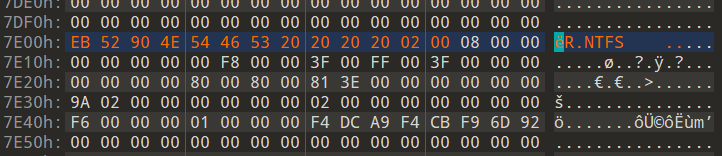

### 内存取证初体验

看讲义的话就知道有个 editbox 插件，直接拿来用即可。

```bash
$ .\volatility_2.6_win64_standalone.exe -f .\dump.vmem editbox
```


### Deleted File

~~这现充的硬盘大小居然高达 16 MB~~


镜像里有个 password.txt，尝试恢复文件，发现有个 flag.zip，于是拿 password.txt 里面的密码打开压缩包即可。


### Login Password

~~如果不理解，为什么不多搜索呢~~

当时说的时候是说在 Github 上搜，然而国内随便搜搜也能搜到。


Github 搜 LM，发现有个 hashdump 插件可以获取 LM Hash，用一下试试：


如果不理解显示出来的内容的话还可以接着搜索，可以知道：

- Crabtux 是用户名
- 1003 是 RID
- b5...da 是 LM Hash
- d6...e6 是 NTLM Hash

题目说了 LM Hash 不安全，而且给了个神必网站，实际上就是个 LM Hash 的数据库，直接把获得的 LM Hash 丢进去即可。


题目说了全大写提交，那就全大写提交即可。


### Corrupted Disk

这题估计绝大多数人都是非预期解，是出题人的失误，非常抱歉~~红豆泥私泥马赛~~，这里还是说一下预期解好了。

首先拿 010 Editor 打开下载下来的镜像，这玩意显然是坏的，具体坏到什么程度呢？

- MBR 区域的 bootloader 被抹掉了，但是我们不在乎这个
- 分区表炸了一部分，但是题目里说了，分区表的损坏不算大


我们选中的这一块就是分区表，题目说了，原本的分区方案就是两个 NTFS 的主分区，那么对着讲义里的表格修修补补就行，注意不要动任何与扇区、Logic Block Address 和 CHS 地址有关的值：

| 偏移 | 长度（Byte） | 字节序 | 意义                                             |
| ---- | ------------ | ------ | ------------------------------------------------ |
| 00h  | 1            | ...    | 标识分区状态。00h -> 非活动分区；80h -> 活动分区 |
| 01h  | 3            | 小端法 | 以 CHS Address 的格式确定该分区第一个扇区的位置  |
| 04h  | 1            | ...    | 文件系统标识位。注意，分区是否隐藏也在此标识     |
| 05h  | 3            | 小端法 | 以 CHS Address 的格式确定该分区结束位置          |
| 08h  | 4            | 小端法 | 分区起始相对扇区号                               |
| 0Ch  | 4            | 小端法 | 该分区使用的扇区总数                             |

修好之后拿 DiskGenius 打开，发现仍然无法识别文件系统，并且发现 DRIVE 模板还是不能直接识别出分区，那么利用分区表的扇区数进行跳转，查看分区的第一个扇区。以第一个扇区为例，它的 Relative Sector 为 0x3f，那么拿 63 * 512 得到 32,256，跳转到对应的地址查看分区的第一个扇区：


很显然这玩意还是坏的，指令那块还是被抹掉了，按照 NTFS 引导扇区的格式，先把前面的修好试一试：



然后用 DiskGenius 打开，发现已经能够正常识别分区：


看到一个 Totally Innocent File，显然很可疑，把它搞出来，发现是个 pdf 文件，打开就是 flag。


### 小心翼翼

这题似乎没人做，所以题解写简略一点，主要是内存 + 磁盘镜像取证的混合。

首先查看进程，能看到一个 TrueCrypt.exe，上网查询发现这是个用来加密磁盘的玩意，正好题目也给了个加密的磁盘镜像。

然后再上网查查，发现了这个玩意：


但是 truecryptpassphrase 不能直接提取出密码，那就使用 truecryptmaster 提取出 master key，然后找个脚本解密即可。


### Innocent Process

~~不会有人不认识 Tohsaka Rin 吧，不会吧不会吧~~

这题感觉上会略微偏向实战一点（虽然难度跟实战相比很低，当然我不是否定这题的难度，放在这里确实还是很难的）。

直接用插件会报错，那么首先用 imageinfo 查看内存镜像对应的操作系统：


后面的命令都要带上 `--profile=Win7SP1x64` 参数。

都说了是进程的问题，直接 pslist 看看：


Totally Innocent Process……很显然这就是那个可疑进程。

说是要休眠时间，动动脑子就知道，需要分析可执行文件本身而不是内存镜像，所以思路就是把文件从内存里提取出来，然后逆向看看有没有跟休眠有关的指令。


找到一个 procdump 插件，可以用一下试试：


然后拿 IDA 打开，发现很坏，符号表又被噶了，但是函数数量本身不是很多，那就直接一个个点进去，直到看到 `sub_402660` 函数：


嗯，看到了 Sleep 函数，但是不太对，它是在一个无限循环里面，并且能看到 socket 之类的函数，显然这是已经开始监听了，那么看一下这个函数被谁引用了：


嗯，跳转到 `sub_402964` 函数看看：


这次好像对味了，注意这里 Sleep 函数的参数是以 ms 记的，我们要求提交的是秒数，所以最终应该提交 flag{300}。