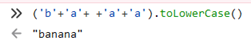

**信安实践报告**

**PB20071400** **秦浪**

1. 十六进制-参上

题目属于明示了，直接百度一个十六进制在线编译器，人工输入，flag一下就出来了。

2. 2048

在助教的讲解下，直接F12，在查看器中把一层一层的代码行点开，发现了

然后将该文件打开，找到游戏胜利的条件:

利用控制台运行代码 ('b'+'a'+ +'a'+'a').toLowerCase()，得到：

打开该网站得到flag
3.  虚假的安全
该题目为一个简单的异或运算，密钥未知，但已知输出结果以及明文的前5个字符以及最后一个字符（明文包含flag{}）
根据题目中给出的函数以及异或运算的性质，先求出密钥:

得到密钥，再求出明文:

得到flag

4. 你的名字

打开题目，先输入助教名字，发现提交键坏掉了，F12，在查看器里查看代码，发现了disabled（disabled 属性规定应该禁用 input 元素。被禁用的 input 元素既不可用，也不可点击。） 

删除后，输入助教名字，发现仍没有flag，于是再次F12，再次仔细看代码，发现了<script>标签中的代码，发现其中通过ajax请求得到flag，于是将其复制到控制台中，修改变量，运行，得到flag

