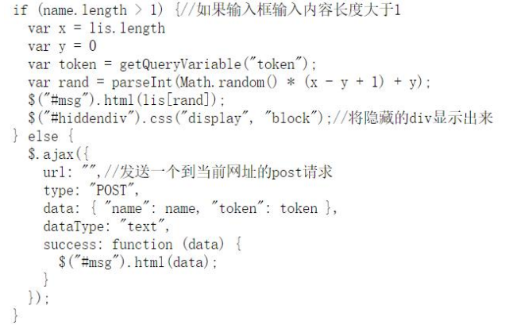

# 第一次实验 

## 实验一：进制十六——参上 

实验思路：可以发现，左侧每个数字对应右边一个字母 ASCII 码的十六进制表示， 因此，只要找到 flag 在左侧数字中的位置，再挨个对照翻译即可，当然，也可以 写个脚本（当时没想到....一个一个算的） 

## 实验二：虚假的安全 

实验思路：利用异或的性质，将 secret 数组和“flag{”进行异或，即可得到密钥， 再用 secret 和密钥进行异或得到明文。这个计算量有点大，我用 python 写了个 脚本，但是在机房的电脑上（要哭了......） 

## 实验三：你的名字 

实验思路：查看源代码发现，最重要的部分在下面这段代码

因为输入长度总是大于 1，所以总是执行上半部分的代码，要想拿到 flag，就要 执行 ajax。只需要在控制台执行 ajax 即可拿到 flag。