# 信安实践第二次题解
## 4.3_On_sale
- 倒计时结束后,刷新,在Burp Suite中抓包 , 发现get请求到buy.php;点击 提交订单 按钮, 发现post请求到check.php,且post请求中包含需要填写的内容。
    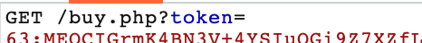
    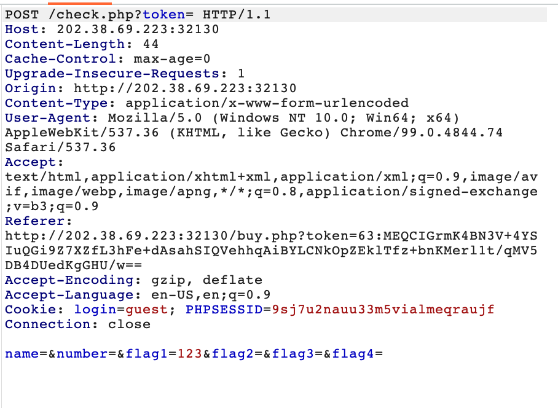
- 因此想到只需使用python脚本在8s内向check.php发送post请求即可。

## Uncompleted+
- 首先下载损坏的zip文件,使用16进制编辑器UltraEdit打开.发现头文件标记50 4B 03 04被篡改,将前八位改回正确后压缩文件即可打开。
    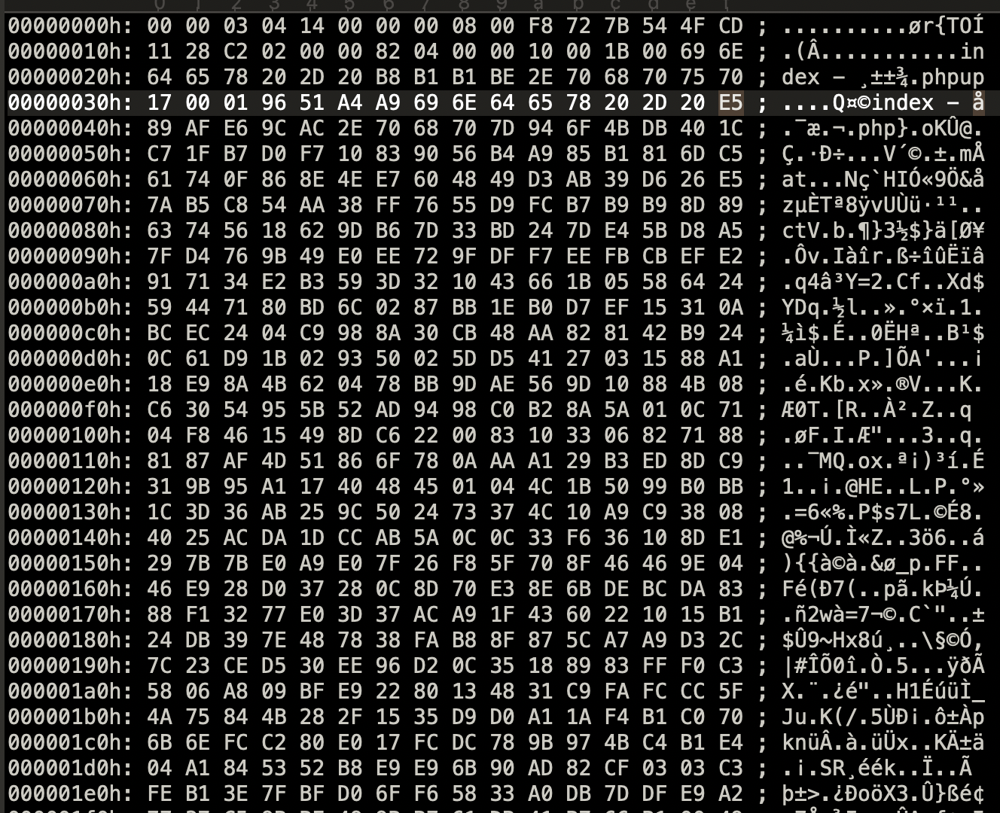
- 打开压缩包中的 index-副本.php 文件,该文件即为服务器端的网页源码。阅读源码后发现,需要在http头部加入referer,X_FORWARDED_FOR,以及修改USER-AGENT
    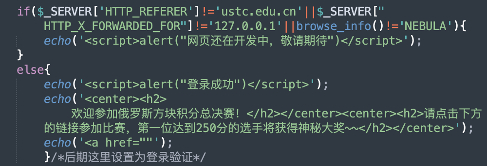
- 使用firefox浏览器插件hackerbar,修改http头为上述形式,点击execute,显示登陆成功!
    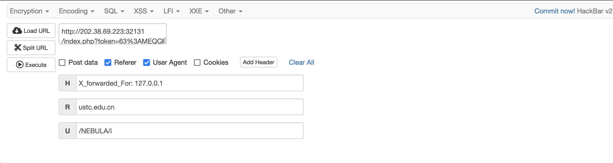
- 查看 俄罗斯方块总决赛 网页源代码,成功找到比赛页面的链接 \****\.html, 终于可以进入250挑战赛啦!
    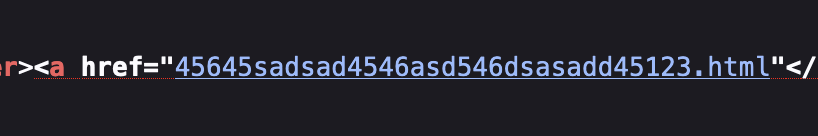
- 可以发现,这道题的游戏界面与之前的Uncomplete 完全一致,因此直接找到js文件,查看score的判断逻辑。
    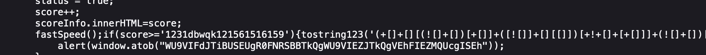
- 发现,if的判断条件居然是score>='1231dbwqk121561516159'.
  (显然即使达到了250分,也拿不到flag,差评!/doge)
    首先想到能否将score修改为字符串,通过字符串比大小进入条件语句;但发现前一条语句是score++,如果score为字符串,则会返回NaN,之后的条件判断不可能为true.
    而数字类型的score与字符串进行比较,始终会返回false,因此无法通过修改score的值进入条件语句。
- 既然无法进入,那不如直接看看这里面的代码干了啥. if语句块中一共就2条语句,先看比较正常的第2条语句，在控制台中输入 alert(window.atob("WU9VIFdJTiBUSEUgR0FNRSBBTkQgWU9VIEZJTkQgVEhFIEZMQUcgISEh")) ,发现这串base-64编码解码后是
    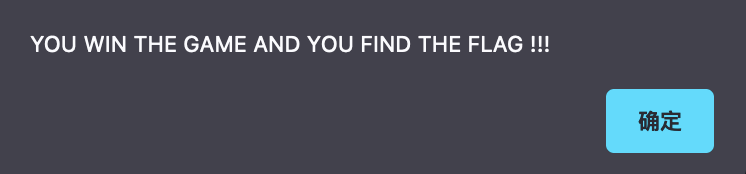
    因此可以合理推测,前一句由一长串(),[]组成的shit就是flag.
    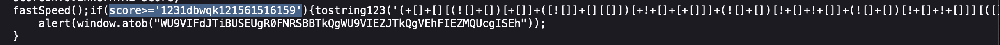
- 找到tostring123()的定义,发现它就是在控制台输出这一长串 shit
    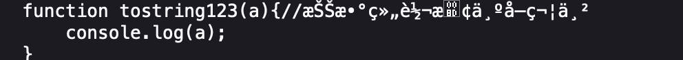
- 因此尝试将这一长串shit 直接复制到console里,回车, 然后。。。
    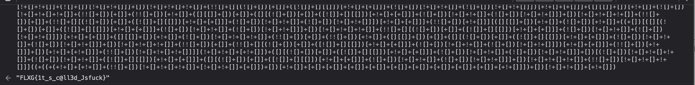
- 虽然得到了flag,但总觉得这过于离谱,于是又仔细看了眼, 明白了其中的奥义。
    对于 [], Js会返回一个空Array, 因此对于 ![] ，Js会返回false;
    对于 Array+Array,Js会将两个Array连接为一个字符串,
    因此对于 ![]+[], Js返回了字符串"false". 
    然后通过 +[] , Js返回0 ,
    就可以使用 (![]+[])[+[]]得到字符串的首字母”f“
    以此类推,就可以得到各种字符。
- 题目解完了 , Js,f**k!