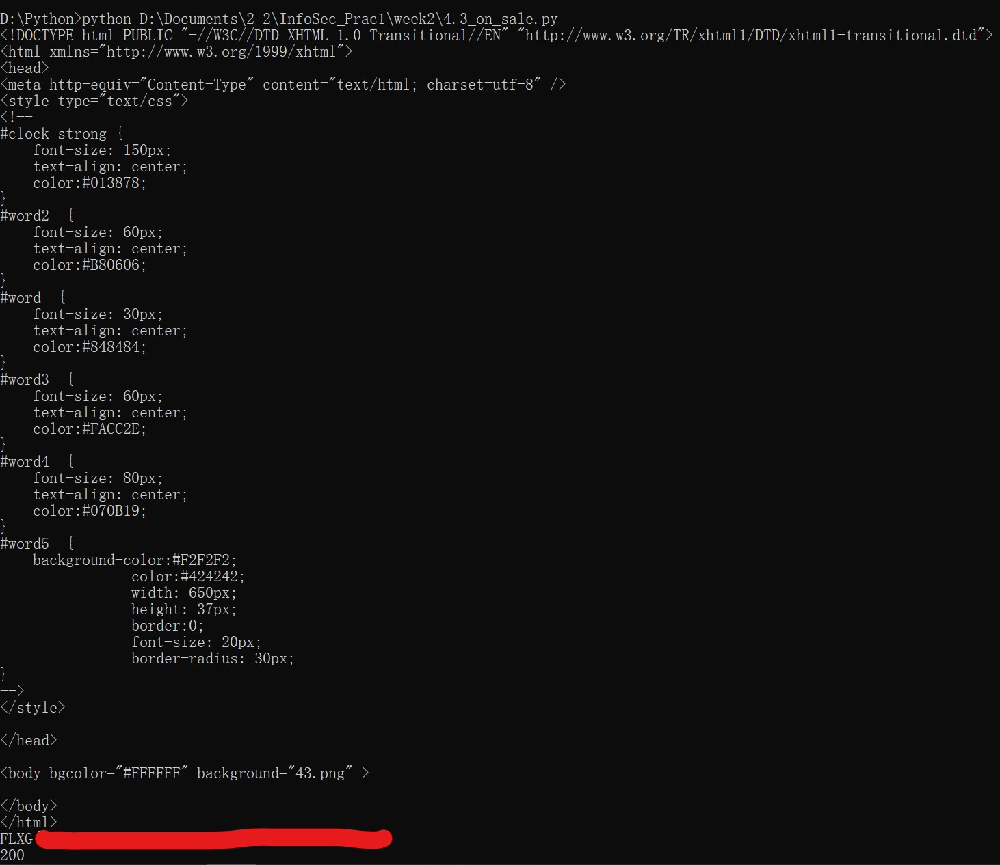
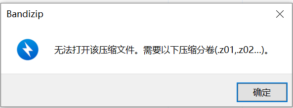

# PB20051125关佳旺4.3_On_Sale&Uncompleted+题解

## 4.3_On_Sale

进入网页，等待倒计时结束后刷新页面，跳转到`/buy.php`，需要提交名字、学号、前四题的flag后提交表单才能得到flag

**1. burpsuite + 一定手速**（上课时所用方法）

`/buy.php`通过POST请求方式提交，将在`/buy.php`中点击“提交”后的POST请求的全部内容进行复制

```
POST /check.php?token= HTTP/1.1
Host: 202.38.69.223:32130
……
……
……
Upgrade-Insecure-Requests: 1
Cache-Control: max-age=0

name=&number=&flag1=&flag2=&flag3=&flag4=
```

向最后的`name=&number=&flag1=&flag2=&flag3=&flag4=`中添加对应内容（需要经过URL编码），Ctrl+A&C全选后复制，在burpsuite抓包后立刻Ctrl+A选定包中全部内容，Ctrl+V替换为包含信息的内容，放包，得到flag

**2. 利用脚本**

以上做法建立在8秒时长的前提下，如果要求增高（如改为1秒以下），以上方法可能不适用。更好的方法是编写脚本进行以上操作

使用python的requests库进行

```python
import requests
url = 'http://202.38.69.223:32130/check.php?token=xxxxxxxxxx'
      #倒数结束后由timer.php跳转至buy.php
      #在buy.php提交信息后跳转至check.php，最终能否拿到flag与check.php有关
      #注意token的值需要经URL编码
d = {'name': 'xxx',#姓名
     'number': 'xxxxxxxxxx',#学号
     'flag1': 'FLXG{xxxxxxxxxx}',#flag of GET
     'flag2': 'FLXG{xxxxxxxxxx}',#flag of POST
     'flag3': 'FLXG{xxxxxxxxxx}',#flag of Dummy_Agent
     'flag4': 'FLXG{xxxxxxxxxx}' #flag of Dummy_Cookie
    }
r = requests.post(url, data=d)#向url传入数据data为d的post请求
print(r.text)#打印网页的响应内容
print(r.status_code)#打印响应状态码（非必需）

```

注意，使用脚本依然要等待timer.php网页的倒数，由此可知8秒时限从倒数结束开始，可以更自动化，检测到timer.php倒数结束后自动发送请求

运行脚本后得到如下结果



在响应的最后一行得到flag（最后一行200为`print(r.status_code)`语句得到的HTTP状态码，200对应名称为“OK”，表示请求成功。一般用于GET与POST请求）

## Uncompleted+ (一级web)

进入题目网页，显示“网页还在开发中，敬请期待”，考虑从附件找突破口

下载附件“backup.zip”，打开后显示文件压缩分卷有缺失



用Hex软件打开压缩文件，查看文件问题，同时搜索资料，了解.zip文件格式~~（在实验前一天看到了原本的题目描述，了解到此文件的文件头有所损坏）~~

打开文件后发现文件开头为`00 00 03 04`，而zip文件文件头为`50 4B 03 04`（头文件标记，0x04034b50），修改前四位数字后正常解压得到index.php文件

<font color=grey>——之所以软件提示“需要以下压缩分卷(.z01,.z02...)”，是因为有时为了方便上传下载，会将压缩文件分割成多个文件（压缩分卷），末尾标注".z01,.z02..."，解压时可借由标记完整解压。题目中下载的.zip文件开头没有正常的头文件标记，解压软件判断此文件为压缩分卷中的一个，而找不到有正常文件头的.z01文件，因此提示“需要以下压缩分卷(.z01,.z02...)”</font>

打开index.php文件，发现有开头有`<html>`，尝试将空白网页代码替换为index.php的内容，并没有找到突破点。选择阅读源码，发现有

```php
if($_SERVER['HTTP_REFERER']!='ustc.edu.cn'||$_SERVER["HTTP_X_FORWARDED_FOR"]!='127.0.0.1'||browse_info()!='NEBULA'){
		echo('alert("网页还在开发中，敬请期待")');
	}
```

查询`HTTP_REFERER`和`HTTP_X_FORWARDED_FOR`，发现分别对应http请求的header中的“引荐网页”`Referer`字段和“用来识别通过http代理或负载均衡方式连接到的客户端最原始的ip地址”的字段`X_Forwarded_For(XFF)`字段。要正确登录，需要满足`if`语句中所给条件刷新网页，在请求中添加

```html
Referer = ustc.edu.cn
X_Forwarded_For = 127.0.0.1
```

由`browse_info()!='NEBULA'`得知，还需要将`User_Agent`的值改为`NEBULA`，完成以上修改后放包，浏览器显示登录成功。在登陆成功的网页元素中，有a标签

```html
<a href="45645sadsad4546asd546dsasadd45123.html" <="" body="">
</a>
```

访问这个网址([俄罗斯方块](http://202.38.69.223:32131/45645sadsad4546asd546dsasadd45123.html))，来到了与Uncompleted相同的俄罗斯方块游戏的界面，打开F12，找到`js/css.js`对应的网址([202.38.69.223:32131/js/css.js](http://202.38.69.223:32131/js/css.js))，存放了游戏的代码，查找“score”（或者直接下滑看到）如下语句

```js
if(score>='1231dbwqk121561516159'){tostring123('(+[]+[][(![]+[])[+[]]+([![]]+[]
……
……
……
[+[]]+[+[]]+[+[]]+[+[]]+[+[]]+[+[]]+[+[]]+[+[]]+[+!+[]]])+[])[!+[]+!+[]]+[+!+[]])');
```

之前做过一些CTF题目，看到这些符号，想到了见过的一些特殊（奇葩）编码，搜索后发现字符是**JSFuck编码**（题目描述中的**“\*u\*k!!!”**也算是提示了）

直接将编码内容复制粘贴进在线解码网页（注意编码在`tostring123('')`中，只能复制两个单引号之中的字符），得到flag