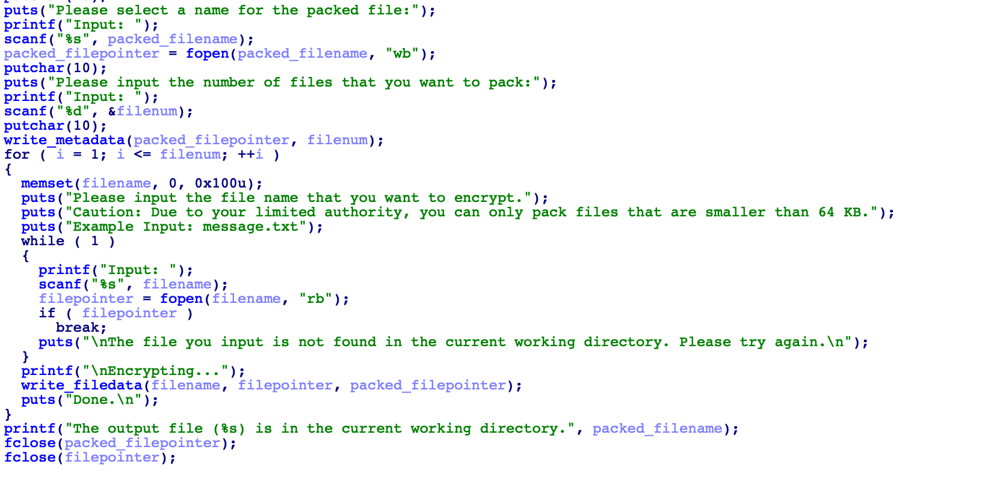
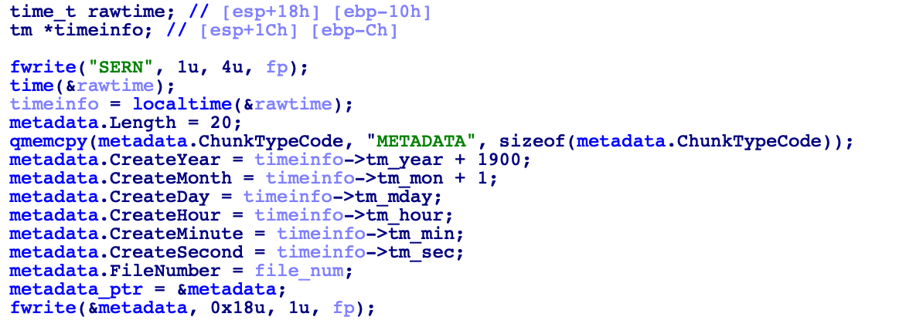
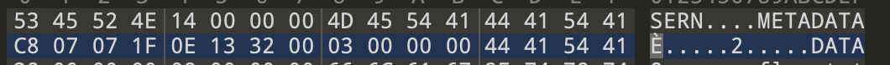

# 信安实践第8次题解
## Steins;Gate
- 逆向Encryptor.exe,得到加密器的代码逻辑:write_metadata()函数用于输出元数据,write_filedata()函数用于加密输出文件内容。

- 对于文件生成日期,查看write_metadata()函数,可知会输出"METADATA"+年份+月份+日期

- 使用010editor打开cern文件,发现年份16进制为C8 07,月份为07,日期为1F;由于年份int32为小端模式,因此年份为7*16+0xc8=1992,月份为7,日期为31

- 对于文件加密内容，查看write_filedata()函数,发现它会输出 文件名+文件长度+AES_CBC加密后的数据

- 在010editor中查看cern文件,发现文件名"flag.txt"+文件长度32+密文,

- 因此将32Bytes的密文使用Python AES库CBC模式解密,其中秘钥key与初始向量IV可以在encryptor.exe的逆向中找到,最终就可以得到flag。
